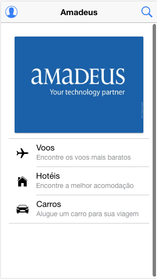
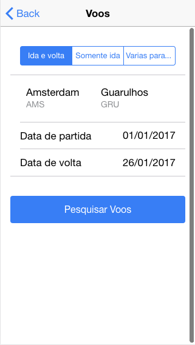

# Demo Amadeus API

	Demo Ionic For Amadeus API

## Demo

Clone

```
git clone https://github.com/humbertodias/java-amadeus-api-demo.git
```

Enter

```
cd amadeus-demo
```

Start
```
ionic serve
```

On Browser

```
http://localhost:8100/
```

Home



Form Flight




### Flight Inspiration Search

```
curl -X GET "https://api.sandbox.amadeus.com/v1.2/flights/inspiration-search?apikey=WGJ5qAqZX1WzUlCNi95HnQiluKryMITS&origin=NYC&destination=BOB&departure_date=2017-02-28"
```


### output

```
{
  "origin" : "NYC",
  "currency" : "USD",
  "results" : [ {
    "destination" : "BOB",
    "departure_date" : "2017-02-28",
    "return_date" : "2017-03-01",
    "price" : "1694.10",
    "airline" : "VX"
  } ]
}
```

## References

[https://sandbox.amadeus.com/api-catalog](https://sandbox.amadeus.com/api-catalog)

[https://ionicframework.com/docs/v2/components/](https://ionicframework.com/docs/v2/components/)